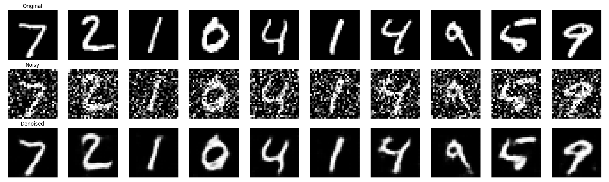
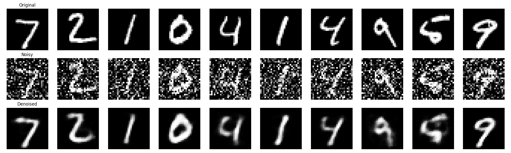

# MNIST Denoising Comparison

This report compares two approaches for denoising MNIST digits: a **Convolutional Autoencoder (ConvAE)** and a **Multi-Layer Perceptron Autoencoder (MLP-AE)**.

## Methodology

### 1. Convolutional Autoencoder (`conv_ae`)
- **Structure**: Uses `Conv2d` layers for encoding and `ConvTranspose2d` for decoding.
- **Key Features**:
    - Preserves spatial locality of pixels.
    - Uses `BatchNorm2d` and `LeakyReLU` for stable training.
    - **Parameter Count**: ~20k parameters (lightweight but powerful).

### 2. MLP Autoencoder (`mlp_ae`)
- **Structure**: Uses fully connected `Linear` layers.
- **Key Features**:
    - Flattens the 28x28 image into a 784-vector.
    - Learns global relationships but loses spatial context.
    - **Parameter Count**: ~220k parameters (significantly larger than Conv).

## Performance Comparison

Both models were trained for 5 epochs with `MSELoss` and `Adam` optimizer (LR=1e-3).

| Model | Final Loss (MSE) | Observation |
| :--- | :--- | :--- |
| **Conv AE** | **0.0123** | Sharper edges, less blur, better noise removal. |
| **MLP AE** | 0.0188 | Slightly blurrier results, some artifacts remain. |

*Lower loss indicates better reconstruction.*

## Visual Results

### Convolutional Model Results

*Clearly distinct digits with minimal noise artifacts.*

### MLP Model Results

*Digits are recognizable but edges are fuzzier compared to the Conv model.*

## Conclusion
The **Convolutional Autoencoder** outperforms the MLP version significantly. Despite having fewer parameters (~10x fewer), it achieves a lower reconstruction error and produces visually superior images. This demonstrates the inductive bias of CNNs is highly beneficial for image tasks.
